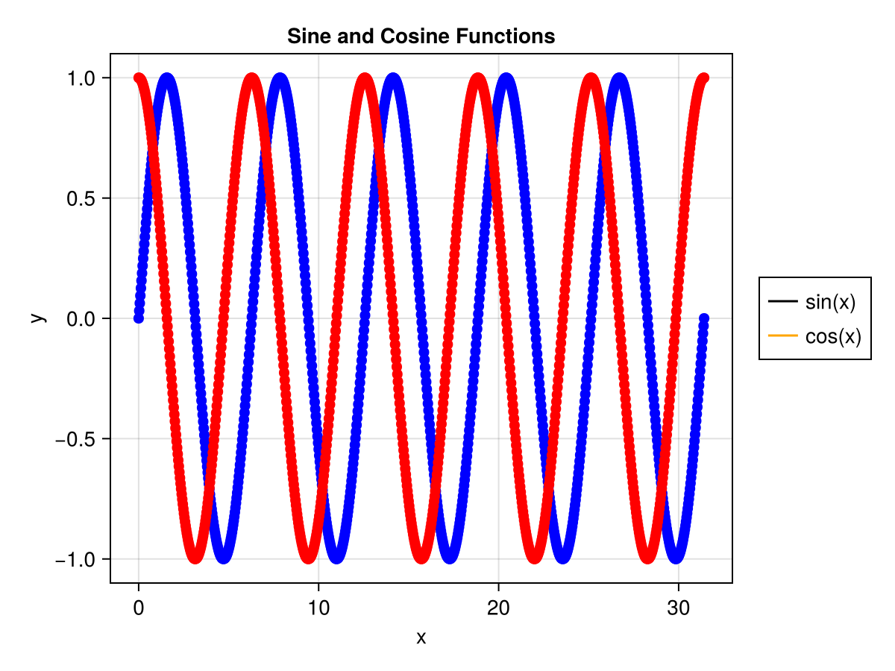
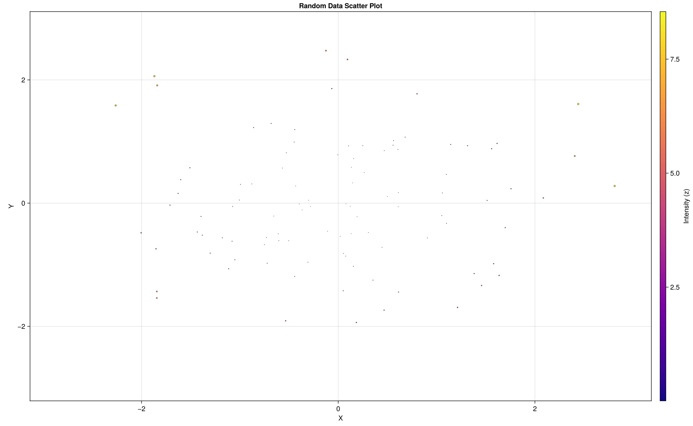
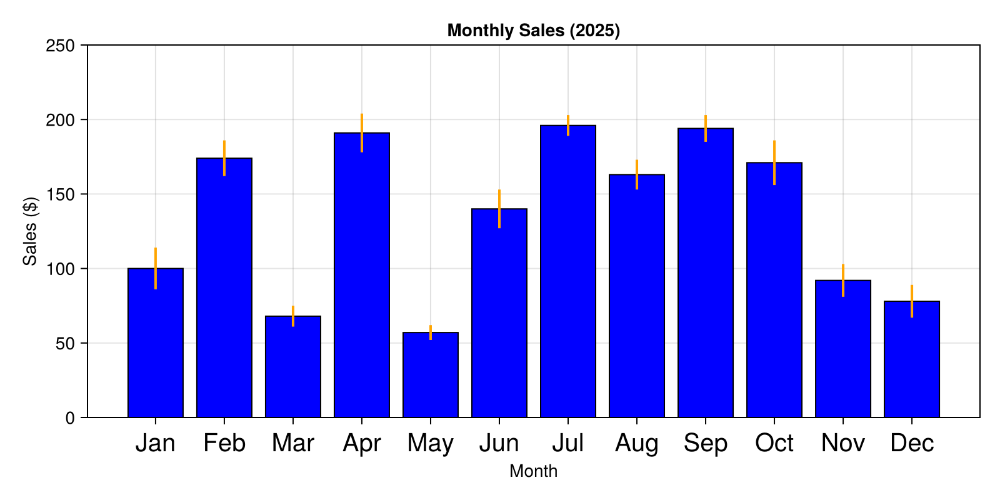
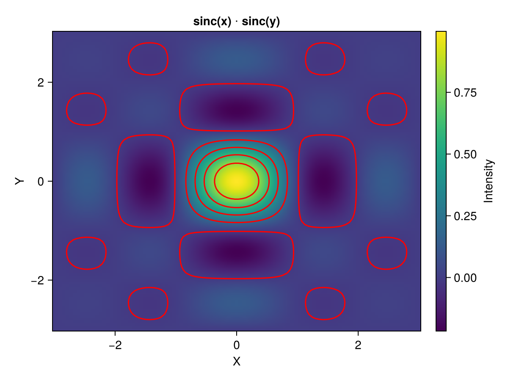
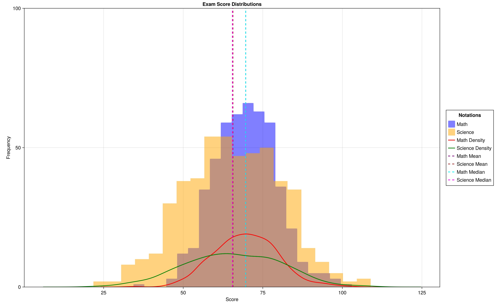
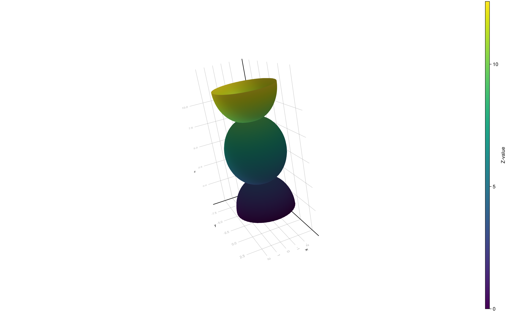
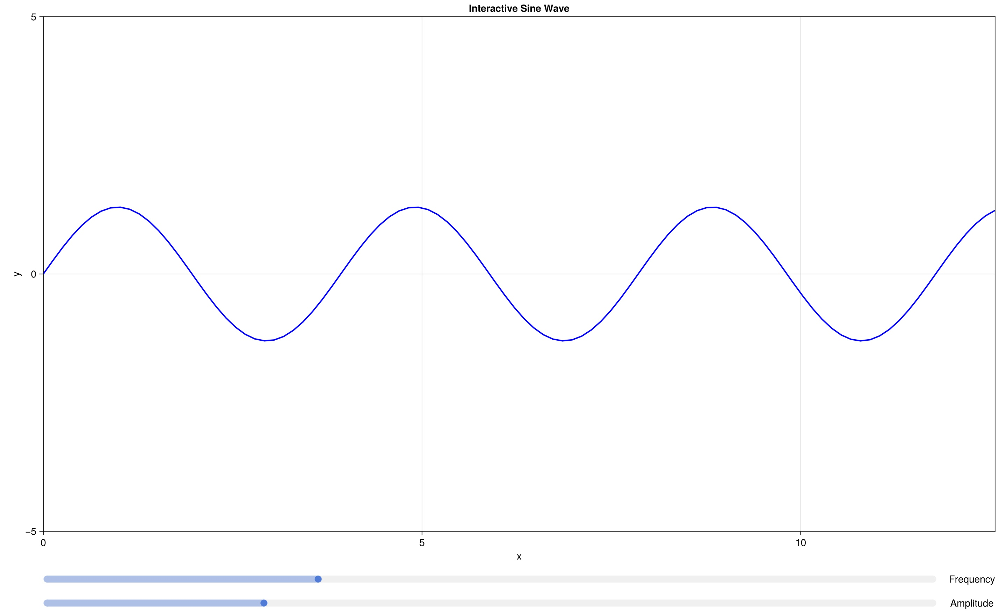

# 1. plot.jl

# 2. scatterplot.jl

# 3. barchart.jl

# 4. heatmap.jl

# 5. histogram.jl

# 6. surfaceplot.jl

# 7. Animation.jl
<iframe width="560" height="315" src="https://www.youtube.com/embed/XcPseP6BeNk" frameborder="0" allowfullscreen></iframe>

# 8. InteractiveWidgets.jl

